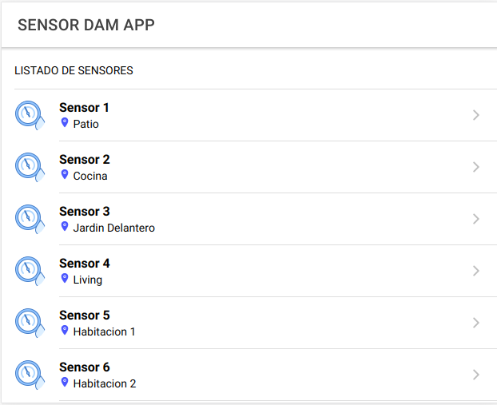
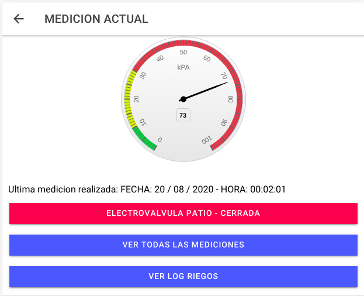
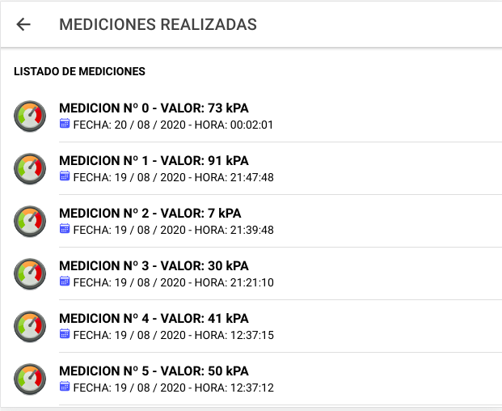
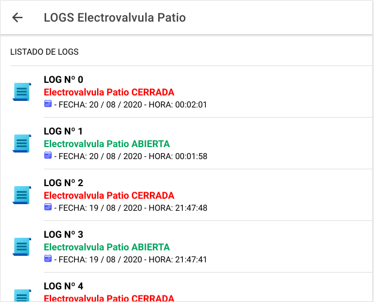

Autor: Domenje Carlos R. - 2020

# TP DAM

Proyecto Final Diseño Aplicaciones Multiplataforma

## Introduccion 🚀

Este proyecto se realizo como parte del trabajo practico final de la catedra Diseño de aplicaciones multiplataforma.

Este trabajo consiste en diseñar una aplicacion que muestre un listado de sensores que estan alojados en una base de datos. 

Ademas, debe tener la posibilidad de ingresar a cada sensor y ver su ultima medicion, poder abrir y cerrar la electrovalvula, generar logs y mediciones.


Mira **Despliegue** para conocer como desplegar el proyecto.


### Pre-requisitos 📋

[Docker](https://docs.docker.com/get-docker/)  y [Docker Compose](https://docs.docker.com/compose/install/) son necesarios para la ejecucion del backend donde se ejecutan contenedores de Node, MySQL y phpMyAdmin.

[Npm](https://docs.npmjs.com/cli/install) Para realizar la instalacion de paquetes utilizacion por la aplicacion.

[Ionic](https://ionicframework.com/docs/intro/cli) es necesario para ejecutar la aplicacion.


Guia de instalacion en Ubuntu 18,17,16 y 14
[Docker install - Ubuntu](https://iot-es.herokuapp.com/post/details/2) 

Opcional: 
[Git](https://git-scm.com/book/en/v2/Getting-Started-Installing-Git) es necesario si quiere realizar por linea de comandos el clone del repositorio.

Descargar o clonar el repositorio del proyecto.
```
git clone https://github.com/carlosdomenje/dam_tp_final.git

```

## Despliegue 📦

Para realizar el despliegue de la aplicacion primero debera ingresar a la carpeta del proyecto:

```
cd dam_tp_final
```
Abrir una terminal y ejecutar:

```
docker-compose up
```
Abrir otra Terminal, dirigirse a la carpeta sensorDAM, instalar dependencias necesarias y ejecutar el comando de Ionic para ejecutar la aplicacion.

```
cd sensorDAM

npm install

ionic serve
```
Espere a que se abra el navegador web con la aplicacion o bien abra una pestaña e ingrese:

```
http://localhost:8100
```


## Captura de la aplicacion 📳️






## Herramientas utilizadas 🛠️

* [Docker](https://docs.docker.com/)
* [NodeJS](https://nodejs.org/en/)
* [MySQL](https://www.mysql.com/) 
* [phpMyAdmin](https://www.phpmyadmin.net/)
* [Ionic](https://ionicframework.com/)


## Contribuir 🖇️

Puede contribuir realizando un pull request con las sugerencias al proyecto.

## Wiki 📖

Para mayor informacion referido al contenido de la catedra podran dirigirse al siguiente [repositorio](https://github.com/brianducca/dam), el cual pertenece al Ing. Brian Ducca quien dicto la catedra DAM.

## Versionado 📌

Se utiliza [Git](https://git-scm.com/) para el versionado. Para todas las versiones disponibles, mira los [tags en este repositorio](https://github.com/carlosdomenje/dam_tp_final.git).


## Licencia 📄

Este proyecto está bajo la Licencia GPL.

## Gratitud 🎁

Agradezco al docente de la catedra Ing. Brian Ducca quien nos brindo sus conocimiento sobre estas tecnologias para diseño de aplicaciones multiplataforma.


---

